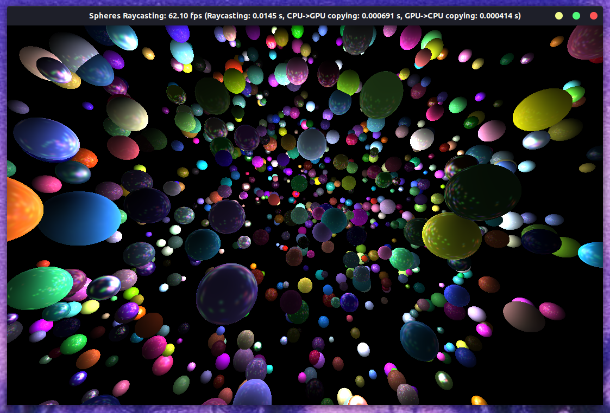

# Sphere Raycasting

This project contains the source code of basic 3D [ray caster](https://pl.wikipedia.org/wiki/Ray_casting) of spheres with [Phong reflection model](https://en.wikipedia.org/wiki/Phong_reflection_model).

## Description
Implementation was based on [Ray Tracing in One Weekend](https://raytracing.github.io/books/RayTracingInOneWeekend.html) series and [Accelerated Ray Tracing in One Weekend in CUDA](https://developer.nvidia.com/blog/accelerated-ray-tracing-cuda/) from NVIDIA's Developer Blog.
