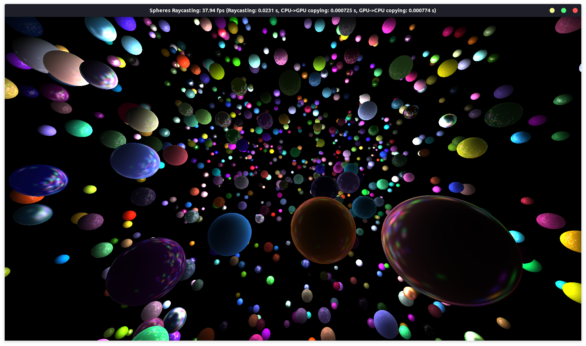

# Sphere Raycasting



## Description

This project contains the source code for basic 3D [ray caster](https://pl.wikipedia.org/wiki/Ray_casting) of spheres with [Phong reflection model](https://en.wikipedia.org/wiki/Phong_reflection_model).

Implementation was based on [Ray Tracing in One Weekend](https://raytracing.github.io/books/RayTracingInOneWeekend.html) series and [Accelerated Ray Tracing in One Weekend in CUDA](https://developer.nvidia.com/blog/accelerated-ray-tracing-cuda/) from NVIDIA's Developer Blog.

## Dependencies

Following dependencies were used in this project:

* CUDA SDK 10.1
* OpenGL 4.6.0
* GNU Make 4.2.1

## Build and Run
### Linux
Change the current directory to the sample directory you wish to build, and run make:
```
$ cd sphere-raycasting
$ make
```
After succesfull compilation you should be able to run the program by simply calling:
```
$ ./raycasting
```
By default program will perform a pararell raycasting of scene with 1000 spheres and 200 light sources. If you want to specify certain parameters you need to add command-line arguments. For example command below will run a simulation of raycasting a scene with 2000 spheres and 300 light sources.
```
$ ./raycasting -s 2000 -l 300
```
It is possible to execute raycasting algorithm purely on CPU. In order to do so you need to add `-cpu` argument to your run command.
```
$ ./raycasting -cpu
```
### Usage
When the program is running you can rotate the spheres by dragging mouse while lpm is pressed. If the mouse is dragged the same way but with shift pressed, rotation will apply only to sources of light.
